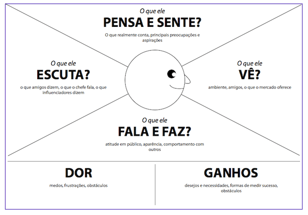

# Projeto de Interface Humano-Computador

Projeto apresentado ao Centro Universitário [FEI](https://portal.fei.edu.br/), como parte dos requisitos necessários para aprovação na disciplina de Interface Humano-Computador (CC8122) do curso de Ciencia da Computação, orientado pelo Prof. Dr. [Fagner de Assis Moura Pimentel](https://github.com/fagnerpimentel).

Este projeto se baseia no Trabalho de Conclusão de Curso (TCC) entitulado **DETECÇÃO DE MACACOS-PREGO POR VISÃO COMPUTACIONAL A PARTIR DE VÍDEOS EM AMBIENTES NÃO-CONTROLADOS** sob orientação do Professor **Rafael Testa** e desenvolvido pelos seguintes alunos:

- Diego Meira Jardim da Silva
- Giovanne Delghingaro Montalvão

## Resumo

Desenvolveremos um sistema automatizado, baseado em aprendizado profundo, para classificar a presença de macacos-prego (Sapajus spp.) em vídeos de ambientes não controlados. Além de criar uma interface gráfica para os usuários poderem escolher os vídeos que querem que sejam analisados.

## Introdução
 
- O sistema desenvolvido tem como propósito automatizar a detecção de macacos-prego em vídeos de armadilhas fotográficas, utilizando técnicas de aprendizado profundo. Ele oferece benefícios como a redução do tempo necessário para análise manual, maior precisão na identificação, padronização dos resultados e apoio direto às ações de monitoramento e conservação ambiental.
- A aplicação busca resolver o problema do grande volume de dados gerados por armadilhas fotográficas, que tornam inviável a revisão manual completa. Além disso, oferece uma solução não invasiva para o monitoramento da fauna em ambientes complexos como florestas tropicais.
- O sistema permite o processamento automático de vídeos, extraindo frames e detectando macacos-prego por meio de redes neurais convolucionais. Entre suas funcionalidades estão a exibição de bounding boxes nas detecções, geração de relatórios de ocorrência, possibilidade de ajuste do nível de confiança, exportação de dados e uma interface simples para upload e visualização dos resultados.
- Como tecnologias, iremos utilizar para desevolvimento a linguagem de programação Python e, como modelo de visão computacionao, YOLOv8s.
- O sistema será utilizado por pesquisadores, ONGs e instituições voltadas à conservação da biodiversidade. Os usuários poderão carregar vídeos obtidos em armadilhas fotográficas e obter automaticamente detecções de macacos-prego. O ambiente de uso inclui tanto laboratórios e centros de pesquisa, onde há computadores com maior capacidade de processamento, quanto aplicações em campo, onde a análise pode ser feita em equipamentos mais simples.

## Publico Alvo
- O produto é direcionado a pesquisadores em biologia da conservação, ONGs ambientais, universidades e órgãos de gestão de áreas protegidas.
- Esse público se caracteriza por atuar principalmente em regiões de florestas tropicais da América do Sul, onde os macacos-prego estão presentes. Demograficamente, inclui profissionais e estudantes de nível superior e pós-graduação. Comportamentalmente, trata-se de um grupo engajado em pesquisa científica, preservação ambiental e uso de tecnologias inovadoras. Psicograficamente, são pessoas motivadas pela conservação da biodiversidade e pela eficiência no manejo de dados.

## Análise de concorrência

1. Entre os principais concorrentes e softwares utilizados pelo público-alvo estão ferramentas de detecção automática de fauna em imagens de armadilhas fotográficas, como Wildlife Insights, TrapTagger e modelos genéricos de visão computacional como YOLO pré-treinados em bases amplas (COCO, ImageNet).
2. Os principais concorrentes são o Wildlife Insights, plataforma global de análise em nuvem; o TrapTagger, voltado à anotação colaborativa; e modelos genéricos como YOLOv5 e Faster R-CNN, amplamente usados em visão computacional.
3. O Wildlife Insights é escalável, mas depende de internet e possui custos. O TrapTagger é simples e colaborativo, porém lento. Já os modelos genéricos têm boa acurácia em contextos controlados, mas sofrem perda de desempenho em florestas tropicais.
4. Essas ferramentas oferecem interfaces acessíveis, mas muitas vezes exigem conexão com servidores externos ou não permitem ajustes finos para espécies locais. A experiência do usuário pode ser comprometida pela dependência de internet em áreas de campo e pela baixa flexibilidade de adaptação aos dados regionais.
5. Plataformas como Wildlife Insights trabalham em modelo freemium ou mediante parcerias institucionais, enquanto ferramentas colaborativas como TrapTagger são gratuitas, mas limitadas. Modelos de deep learning genéricos são gratuitos, porém exigem alto custo computacional em hardware.
6. Estudos apontam que usuários dessas plataformas reconhecem os benefícios da automação, mas reclamam da dependência de infraestrutura tecnológica, da baixa adaptabilidade a diferentes espécies e da falta de suporte local em contextos de conservação na América do Sul.
7. Há uma tendência crescente de especialização de modelos para habitats e espécies específicas, além da busca por soluções mais leves e acessíveis para uso em campo. Outro padrão observado é a integração entre IA e monitoramento participativo, com envolvimento de ONGs e comunidades locais.
8. As soluções existentes são úteis em cenários amplos, mas não atendem bem ao monitoramento de primatas neotropicais. Faltam flexibilidade, robustez em ambientes complexos e adaptação a espécies locais.
9. Entre os pontos fortes estão a escalabilidade, a colaboração comunitária e a base técnica consolidada. Recomenda-se que o sistema proposto seja especializado, robusto em campo e de fácil uso, além de permitir execução offline e adaptação a outras espécies.

### Personas

- Descreva as personas que irão interagir com a aplicação ou produto. Deixe claro suas principais caracteristicas e contextos sociais, econômicos e culturais.
- Quais informações sobre o usuário o serviço ou poduto deve guardar?

  - Persona primaira ...
  - Persona secundária ...
  - Outras personas ...

### Mapa de empatia

- Determine o mapa de empatia[^1] de pelo menos uma persona primária e uma sercundária.
  - O que o usuário vê: aqui estamos falando do ambiente visual em que o usuário se encontra. Ou seja, o que ele efetivamente enxerga, as pessoas e objetos que estão ao seu redor. Isso ajuda a entender o contexto em que o usuário está inserido e as influências visuais que está recebendo.
  - O que o usuário ouve: neste quadrante, buscamos entender o que o usuário está ouvindo, os sons que o cercam e como eles influenciam suas ações.
  - O que o usuário diz e faz: aqui consideramos ações e comportamentos que o usuário apresenta durante sua interação com serviço ou poduto.
  - O que o usuário pensa e sente: neste quadrante, buscamos entender os pensamentos, sentimentos, emoções e percepções que o usuário tem em relação ao serviço ou poduto. Quais expectativas o usuário cria sobre o serviço ou poduto?
  Que tipo de serviço ou poduto mais agrada essa persona?
  - Dores: quando falamos sobre dores do usuário, estamos fazendo referência a quaisquer obstáculos, necessidades ou frustrações que o usuário possa experimentar ao tentar realizar uma tarefa ou alcançar um objetivo. Isso inclui, por exemplo, problemas de usabilidade, dificuldades de acesso ou outros desafios que podem afetar a experiência do usuário.
  - Ganhos: nesse caso estamos falando de quaisquer benefícios ou recompensas que o usuário possa experimentar ao utilizar o serviço ou poduto. Isso pode incluir economia de tempo ou facilidade de uso, por exemplo. Que desejos do usuário o serviço ou poduto satisfaz?

## Contexto de uso

- Descreva o ambiente em que o serviço ou poduto deve ser utilizado.
- Qual/quais o(s) contexto(s) sociais, econômicos e culturais existentes neste ambiente?
- Quais informações sobre o ambiente, o serviço ou poduto deve guardar antes de iniciar a interação?
- O que normalmente deve estar acontecendo com o ambiente quando o usuário interagir com o serviço ou poduto?

## Jornada do usuário

- Criar uma narrativa para o o seu serviço ou poduto com o usuário.
- Determine o que o usuário realiza desde a primeira até o última interação com o serviço ou poduto.
  - Descreva o que acontece ou pode acontecer passo a passo
  - Como a tarefa começa? Como a tarefa se desenvolve? Como a tarefa termina?

<!--
## Análise de concorrência

- Pesquise serviços ou podutos existentes atualmente que possam realizar o objetivo deste projeto.
- Selecione pelo menos 3 serviços ou podutos diferentes.
- Em relação aos concorrentes, respondam as seguintes perguntas?
  - Existe plataforma similar que atende o mesmo mercado e funcionalidades? Se sim: Quais os pontos positivos? Quais os pontos negativos?
  - Existe plataforma diferente quanto ao serviço, mas que atenda esse mercado? Se sim: Quais os pontos positivos? Quais os pontos negativos?
 -->
 
## Coleta de dados

## Modelo de tarefas

## Design

- Pense nas características de Affordances do seu serviço ou poduto. 
    - Que tipo de acessibilidades devem ser consideradas dentro do seu projeto?
- Discuta o papel das expectativas do usuário no projeto deste serviço ou poduto. Qual a importância e pontos a serem considerados se você quiser vender esse serviço ou poduto?

### Prototipação em baixo nível (papel)
#### Avaliação heurística

### Prtotipação em médio nível (Figma)
#### Avaliação heurística

### Prtotipação em alto nível (React)
#### Avaliação heurística

[^1]: Fonte: Adaptado de <https://hazeshift.com.br/mapa-de-empatia/>

<!-- TODOs:
- Add exemplos
 -->
